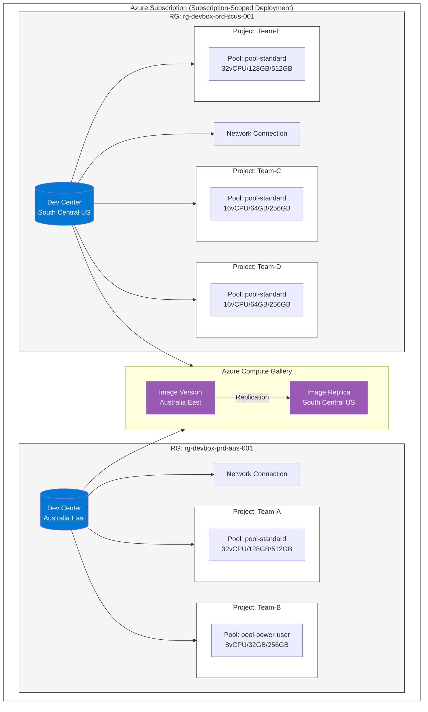
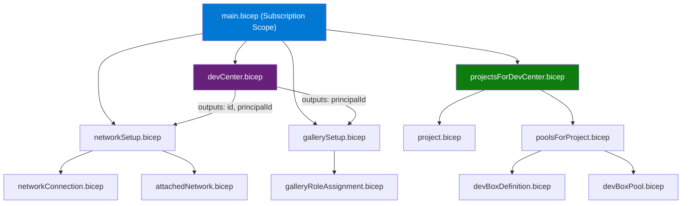
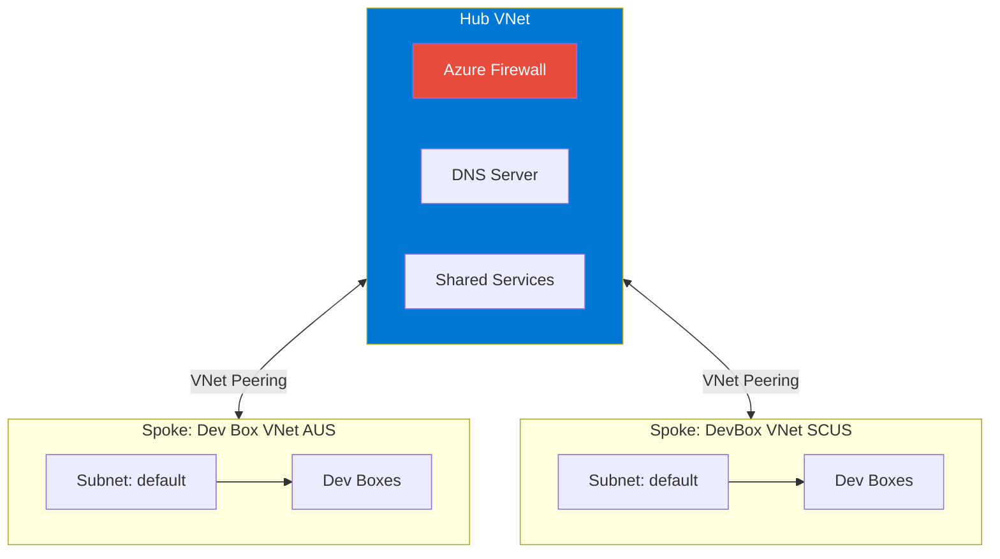
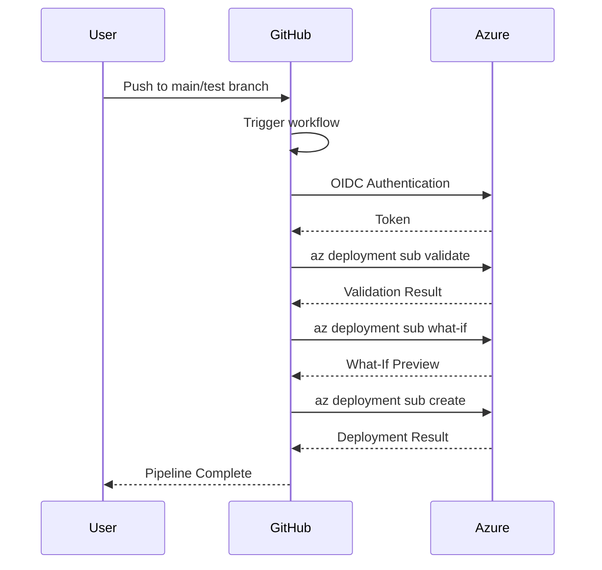
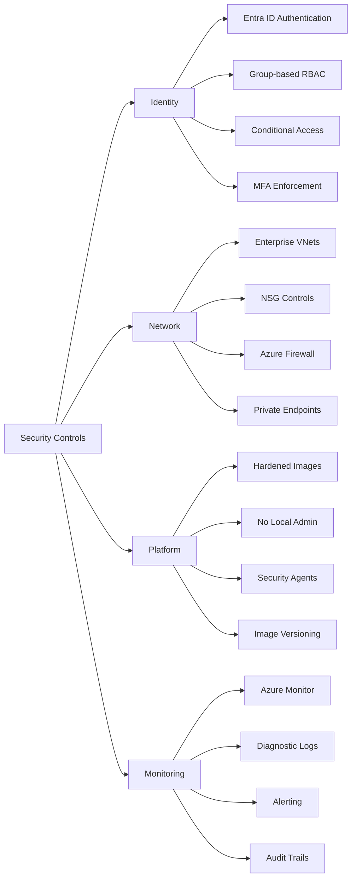
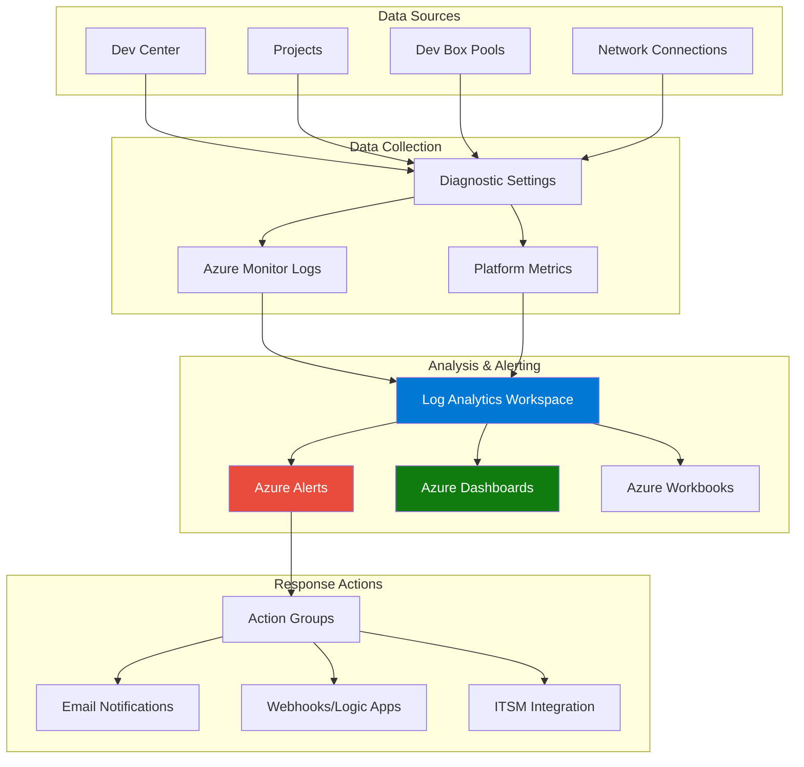
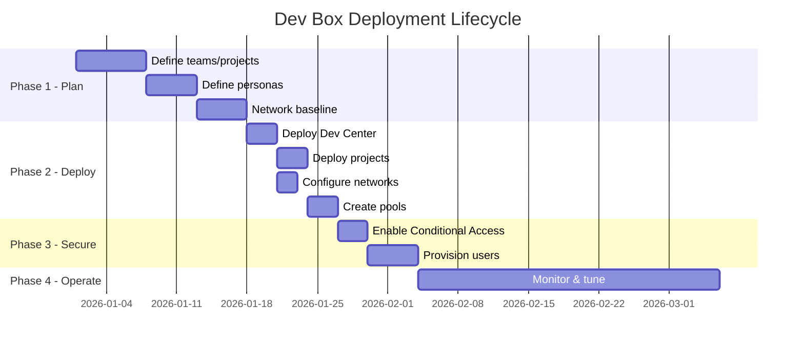

Enterprise Microsoft Dev Box Deployment Blueprint
=================================================

[[_TOC_]]

* * *


<div style="background-color:#0078D4; color:white; padding:10px; border-radius:5px; margin:10px 0;">

<h3 style="margin:0; color:white;">1. Purpose & Business Value</h3>

</div>

---------------------------

### Purpose

This Intellectual Property (IP) provides a standardized, secure, and automated blueprint for deploying **Microsoft Dev Box at enterprise scale**. It establishes Dev Box as a **managed platform service**, fully integrated with enterprise identity, networking, security, and governance models.
The blueprint enables organizations to move away from ad‑hoc end‑user compute (EUC) patterns and adopt a **repeatable, governed, and supportable developer environment platform**.

### Business Value

| Benefit | Description |
| --- | --- |
| ⏱️ **Faster Onboarding** | Reduces developer onboarding time from **weeks to hours** |
| 🎯 **Consistent Experience** | Delivers a **consistent developer experience** across teams |
| 🔒 **Enhanced Security** | Improves security posture for **BYOD and non‑enterprise devices** |
| 🛡️ **Enterprise Controls** | Enforces enterprise controls using **RBAC and Conditional Access** |
| 📊 **Operational Visibility** | Provides **monitoring and alerting** for capacity, provisioning health, and usage trends |
| 🔄 **Repeatability** | Uses **Infrastructure‑as‑Code (Bicep)** and **GitHub Actions** for repeatability |

* * *

<div style="background-color:#0078D4; color:white; padding:10px; border-radius:5px; margin:10px 0;">

<h3 style="margin:0; color:white;">2. High‑Level Architecture Overview</h3>

</div>

-----------------------------------

### Architecture Diagram



### Core Components

| Component | Description |
| --- | --- |
| **Dev Center** | Central governance and management plane for Dev Box with managed identity |
| **Projects (per team)** | Logical isolation, access boundary, and ownership model |
| **Dev Box Pools** | VM SKU, image, network, and policy definition with per-pool customization |
| **Network Connections** | Enterprise-managed VNet integration with Azure AD Join support |
| **Azure Compute Gallery** | Custom image management and distribution |
| **Microsoft Entra ID + RBAC** | Group‑based access control model |

This architecture supports both centralized governance and decentralized team ownership.

* * *

<div style="background-color:#0078D4; color:white; padding:10px; border-radius:5px; margin:10px 0;">

<h3 style="margin:0; color:white;">3. Repository Structure</h3>

</div>

-----------------------

### Actual Repository Layout

    DevCenter-Bicep/
    ├── main.bicep                          # Main orchestrator (subscription-scoped)
    ├── parameters.json                     # Production deployment parameters
    ├── parameters.gallery-example.json     # Gallery configuration example
    ├── README.md                           # Technical documentation
    │
    ├── modules/
    │   ├── devCenter.bicep                 # Dev Center with managed identity
    │   ├── project.bicep                   # Project resource with timezone
    │   ├── devBoxPool.bicep                # Dev Box Pool with auto-stop schedule
    │   ├── devBoxDefinition.bicep          # Dev Box Definition resource
    │   ├── networkSetup.bicep              # Network connection (create/attach)
    │   ├── networkConnection.bicep         # Standalone network connection
    │   ├── attachedNetwork.bicep           # Attach network to Dev Center
    │   ├── projectsForDevCenter.bicep      # Projects wrapper (handles loops)
    │   ├── poolsForProject.bicep           # Pools and definitions per project
    │   ├── gallerySetup.bicep              # Attach Compute Gallery to Dev Center
    │   └── galleryRoleAssignment.bicep     # Grant Dev Center access to gallery
    │
    ├── scripts/
    │   └── (deployment scripts)
    │
    └── .github/
        └── workflows/
            └── deploy-devcenter.yml        # Main deployment pipeline
            
    

### Module Dependency Diagram




### Module Descriptions

| Module | Purpose | API Version |
| --- | --- | --- |
| `devCenter.bicep` | Creates Dev Center with managed identity and `catalogPerProjectEnabled` | `2025-04-01-preview` |
| `networkSetup.bicep` | Creates new or uses existing network connection, attaches to Dev Center | `2025-04-01-preview` |
| `poolsForProject.bicep` | Creates Dev Box Definitions and Pools per project with per-pool settings | `2025-04-01-preview` |
| `project.bicep` | Creates project with timezone (IANA format) and merged tags | `2025-04-01-preview` |
| `devBoxPool.bicep` | Creates Dev Box pool with auto-stop schedule | `2025-04-01-preview` |
| `gallerySetup.bicep` | Attaches Azure Compute Gallery to Dev Center | `2025-04-01-preview` |
| `galleryRoleAssignment.bicep` | Grants Dev Center's managed identity Reader access to gallery | - |

* * *

<div style="background-color:#0078D4; color:white; padding:10px; border-radius:5px; margin:10px 0;">

<h3 style="margin:0; color:white;">4. Deployment Plan – Design Inputs</h3>

</div>

----------------------------------

### 4.1 Region Strategy

Select a primary Azure region aligned with:
*   Developer geographic distribution
    
*   Data residency and compliance requirements
    
*   VM SKU availability and subscription quota
    

> [TIP]  
> Deploy Dev Center, projects, pools, and VNets in the **same region** to reduce latency and operational complexity.

#### Current Production Regions

| Region | Dev Center | Resource Group | Timezone |
| --- | --- | --- | --- |
| Australia East | `dvcenter-dbox-prd-aus-001` | `rg-devbox-prd-aus-001` | `Australia/Sydney` |
| South Central US | `dvcenter-dbox-prd-scus-001` | `rg-devbox-prd-scus-001` | `America/Chicago` |

### 4.2 Dev Center & Project Model

#### Dev Center Strategy

*   **One Dev Center per region** for low-latency access
    
*   Centralized governance and policy ownership
    
*   Catalog per project enabled
    

#### Project Strategy

*Separate Project per Team*
| Benefit | Description |
| --- | --- |
| Clear ownership | Each team owns their project |
| Clean RBAC scoping | Access boundaries per team |
| Cost tracking | Improved chargeback via tags |
| Audit support | Easier access reviews |

* * *

<div style="background-color:#0078D4; color:white; padding:10px; border-radius:5px; margin:10px 0;">

<h3 style="margin:0; color:white;">5. Available SKUs & Images</h3>

</div>

--------------------------

### Dev Box SKUs

| SKU | vCPUs | RAM | Disk | storageType | Use Case |
| --- | --- | --- | --- | --- | --- |
| `general_i_8c32gb256ssd_v2` | 8 | 32 GB | 256 GB | `ssd_256gb` | Standard development |
| `general_i_8c32gb512ssd_v2` | 8 | 32 GB | 512 GB | `ssd_512gb` | Standard with more storage |
| `general_i_16c64gb256ssd_v2` | 16 | 64 GB | 256 GB | `ssd_256gb` | Heavy workloads |
| `general_i_16c64gb512ssd_v2` | 16 | 64 GB | 512 GB | `ssd_512gb` | Heavy workloads + storage |
| `general_i_32c128gb512ssd_v2` | 32 | 128 GB | 512 GB | `ssd_512gb` | Power users, large builds |
| `general_i_32c128gb1024ssd_v2` | 32 | 128 GB | 1 TB | `ssd_1024gb` | Power users + storage |
| `general_i_32c128gb2048ssd_v2` | 32 | 128 GB | 2 TB | `ssd_2048gb` | Maximum storage |

> [!IMPORTANT]  
> The `storageType` must match the disk size in the SKU name.

### Available Images

| Image ID | Description |
| --- | --- |
| `microsoftvisualstudio_visualstudioplustools_vs-2022-ent-general-win11-m365-gen2` | VS 2022 Enterprise + M365 |
| `microsoftvisualstudio_visualstudioplustools_vs-2022-pro-general-win11-m365-gen2` | VS 2022 Professional + M365 |
| `microsoftwindowsdesktop_windows-ent-cpc_win11-22h2-ent-cpc-m365` | Windows 11 22H2 + M365 |
| `microsoftwindowsdesktop_windows-ent-cpc_win11-23h2-ent-cpc-m365` | Windows 11 23H2 + M365 |

* * *

<div style="background-color:#0078D4; color:white; padding:10px; border-radius:5px; margin:10px 0;">

<h3 style="margin:0; color:white;">6. Pool Configuration</h3>

</div>

---------------------

### Pool Configuration Options

Each pool supports per-pool customization:
| Property | Type | Description |
| --- | --- | --- |
| `poolName` | string | Pool resource name (required) |
| `displayName` | string | User-friendly name shown in portal |
| `devBoxSku` | string | VM SKU (overrides global default) |
| `storageType` | string | Disk storage type |
| `autoStopTime` | string | Auto-stop time in HH:MM format |
| `localAdministrator` | string | `Enabled` or `Disabled` |
| `stopOnDisconnect` | string | `Enabled` or `Disabled` |
| `gracePeriodMinutes` | int | Grace period before stopping |
| `galleryImageName` | string | Custom image from gallery |

* * *

<div style="background-color:#0078D4; color:white; padding:10px; border-radius:5px; margin:10px 0;">

<h3 style="margin:0; color:white;">7. Network Architecture</h3>

</div>

-----------------------

### Networking Principles

*   Dev Boxes are deployed into **enterprise‑managed VNets**
    
*   Azure AD Join for domain integration
    
*   Outbound traffic governed by **NSGs, Firewall, or NVA**
    
*   DNS aligned with corporate standards
    

### Network Connection Options

**Option 1: Create New Network Connection**

    {
      "createNetworkConnection": true,
      "networkConnectionName": "network-connection-devbox-prd-aus-001",
      "vnetName": "vnet-devbox-prd-aus-001",
      "vnetResourceGroup": "rg-devbox-prd-aus-001",
      "subnetName": "default",
      "domainJoinType": "AzureADJoin"
    }
    

**Option 2: Use Existing Network Connection**

    {
      "createNetworkConnection": false,
      "networkConnectionName": "existing-network-conn",
      "networkConnectionResourceGroup": "rg-where-it-exists"
    }
    

### Reference Topology

* * *

<div style="background-color:#0078D4; color:white; padding:10px; border-radius:5px; margin:10px 0;">

<h3 style="margin:0; color:white;">8. Deployment</h3>

</div>

-------------

### Deployment Flow



### Local Deployment

    # Login to Azure
    az login
    az account set --subscription "<subscription-id>"
    
    # Validate the template
    az deployment sub validate `
      --location australiaeast `
      --template-file main.bicep `
      --parameters parameters.json
    
    # Preview changes (What-If)
    az deployment sub what-if `
      --location australiaeast `
      --template-file main.bicep `
      --parameters parameters.json
    
    # Deploy
    az deployment sub create `
      --location australiaeast `
      --template-file main.bicep `
      --parameters parameters.json `
      --name "devcenter-$(Get-Date -Format 'yyyyMMdd-HHmmss')"
    

### GitHub Actions Pipeline

#### Required Secrets

| Secret | Description |
| --- | --- |
| `AZURE_CLIENT_ID` | App registration client ID |
| `AZURE_TENANT_ID` | Azure AD tenant ID |
| `AZURE_SUBSCRIPTION_ID` | Target subscription ID |

#### Pipeline Stages

| Stage | Trigger | Action |
| --- | --- | --- |
| Validate | All pushes & PRs | Bicep build and lint |
| What-If | All pushes & PRs | Preview changes |
| Deploy | Push to `main`/`test` | Full deployment |

* * *

<div style="background-color:#0078D4; color:white; padding:10px; border-radius:5px; margin:10px 0;">

<h3 style="margin:0; color:white;">9. Security Model</h3>

</div>


-----------------

##Conditional Access Design

**How Conditional Access Enables This Model**

  

Microsoft Entra Conditional Access serves as the central policy enforcement point for Dev Box access. During each connection attempt, Entra ID performs a real-time evaluation of multiple contextual signals:

  

| Signal | Evaluation Criteria |
| --- | --- |
| **Identity** | User authentication status, MFA completion, group membership |
| **Device** | Management state (Intune-enrolled vs. unmanaged), compliance posture, OS version |
| **Location** | Geographic location, IP reputation, named/trusted locations |
| **Risk** | Sign-in risk level, user risk score, anomaly detection (impossible travel, atypical usage patterns) |


Based on this evaluation, Conditional Access renders an access decision: **grant**, **grant with conditions** (e.g., require MFA, limit session), or **block**.

 

**Policy Design for BYOD Scenarios**

  

| Policy | Target Users | Device Type | Requirements | Session Controls |
| --- | --- | --- | --- | --- |
| **Corporate Devices** | All employees | Intune-managed | MFA + Device compliance | Full access |
| **BYOD/Personal Devices** | Developers, Contractors | Unmanaged | MFA + Risk evaluation | **Clipboard disabled, Drive redirection blocked** |
| **High-Risk Access** | Any user | Any device | Block or step-up MFA | Block if risk is high |
| **Admin Access** | Platform admins | Managed only | Phishing-resistant MFA + Trusted location | Full access, PIM required |

  

**Data Loss Prevention: Keeping Code in the Cloud**


For BYOD scenarios, session controls enforce that sensitive data cannot leave the Dev Box:

 
| Control | Setting | Purpose |
| --- | --- | --- |
| **Clipboard Redirection** | Disabled | Prevents copy/paste from Dev Box to local device |
| **Drive Redirection** | Disabled | Prevents mounting local drives inside Dev Box |
| **Printer Redirection** | Disabled | Prevents printing sensitive content locally |
| **Download Blocking** | Enabled | Files cannot be transferred to local device |


> **Result:** Developers can code, build, and deploy from anywhere—but source code and credentials never touch the personal device.

  

**Business Outcomes**

  

| Benefit | Description |
| --- | --- |
| **Rapid Contractor Onboarding** | Contractors productive on day 1—no hardware shipping required |
| **Global Workforce Enablement** | Work-from-home and offshore teams access same secure environment |
| **Zero Data on BYOD** | Intellectual property remains in Azure, not on personal devices |
| **Compliance Ready** | Audit trail of all access via Entra ID sign-in logs |
| **Cost Reduction** | No need to purchase/ship/manage physical laptops for contractors |

  
  
  

### RBAC‑Based Access Model

Role-Based Access Control (RBAC) governs who can perform actions on Dev Box resources. This blueprint enforces a **group-based access model**—users are never assigned permissions directly. Instead, access is inherited through Microsoft Entra ID security groups.

**Why Group-Based Access?**

- **Scalability**: Add/remove users from groups rather than individual assignments
- **Auditability**: Easier to review "who has access" by examining group membership
- **Consistency**: Reduces configuration drift and orphaned permissions
- **Automation**: Groups can be managed via HR systems or identity governance workflows

  

**Access Hierarchy:**

  

| Scope | Role | Access Level | Typical Assignees |
| --- | --- | --- | --- |
| **Dev Center** | DevCenter Admin | Full control over Dev Center settings, catalogs, and policies | Platform team, Cloud COE |
| **Project** | Project Admin | Manage pools, definitions, and settings within a project | Team leads, Engineering managers |
| **Project** | Dev Box User | Create, start, stop, and delete own Dev Boxes | Developers, Contractors |
| **Pool** | (Inherited) | Access specific pools within a project | Persona-based (Standard, Power User) |

  

**Example Group Naming Convention:**

- `SG-DevBox-PlatformAdmins` → Dev Center-level access
- `SG-DevBox-TeamA-Admins` → Project admin for Team-A
- `SG-DevBox-TeamA-Users` → Dev Box users for Team-A

  

> **Best Practice:** Use Privileged Identity Management (PIM) for just-in-time elevation of admin roles, ensuring administrators only have elevated access when actively needed.

  

### Security Controls Summary

  
  

The Dev Box platform implements a **defense-in-depth** security model across four interconnected pillars. This layered approach ensures that if one control is bypassed, multiple additional barriers protect the environment.

  

| Pillar | Purpose | Key Question Answered |
|--------|---------|----------------------|
| **Identity** | Controls authentication and authorization | *Who* can access Dev Boxes? |
| **Network** | Secures data in transit and network boundaries | *Where* can traffic flow? |
| **Platform** | Hardens the compute environment itself | *What* runs on Dev Boxes? |
| **Monitoring** | Provides visibility, detection, and response | *How* do we detect issues? |

  

**Identity Controls**

- **Entra ID Authentication**: All users authenticate via Microsoft Entra ID (formerly Azure AD)

- **Group-based RBAC**: Permissions assigned through security groups, not individual users

- **Conditional Access**: Context-aware policies enforce device compliance and MFA

- **MFA Enforcement**: Multi-factor authentication required for all Dev Box access

  

**Network Controls**

- **Enterprise VNets**: Dev Boxes deployed into customer-managed virtual networks

- **NSG Controls**: Network Security Groups restrict inbound/outbound traffic

- **Azure Firewall**: Centralized egress filtering and threat intelligence

- **Private Endpoints**: PaaS services accessed over private IP addresses (no public internet)

  

**Platform Controls**

- **Hardened Images**: Security-compliant base images with CIS benchmarks applied

- **No Local Admin**: Users operate without local administrator rights (configurable per pool)

- **Security Agents**: Microsoft Defender for Endpoint pre-installed on all Dev Boxes

- **Image Versioning**: Controlled rollout of image updates with rollback capability

  

**Monitoring Controls**

- **Azure Monitor**: Centralized collection of logs and metrics

- **Diagnostic Logs**: Provisioning events, connection logs, and health checks

- **Alerting**: Proactive notifications for failures, capacity issues, and anomalies

- **Audit Trails**: Immutable record of administrative actions for compliance



* * *


<div style="background-color:#0078D4; color:white; padding:10px; border-radius:5px; margin:10px 0;">

<h3 style="margin:0; color:white;">10. Cost Governance</h3>

</div>

-------------------
### Cost Controls

| Control | Implementation |
| --- | --- |
| **Tagging** | Mandatory tags via IaC: `CostCenter`, `team`, `environment` |
| **Auto-Stop** | Daily auto-stop at 19:00 local time |
| **Stop-on-Disconnect** | 60-120 minute grace period |
| **Max Dev Boxes** | 2-3 per user per project |
| **SKU Right-Sizing** | Persona-based SKU selection |

### Current Tag Configuration

    {
      "environment": "prd",
      "managedBy": "bicep",
      "gitrepo": "<repository-url>"
    }
    

* * *

<div style="background-color:#0078D4; color:white; padding:10px; border-radius:5px; margin:10px 0;">

<h3 style="margin:0; color:white;">11. Timezone Configuration</h3>

</div>

-------------------

Projects use **IANA timezone format** for auto-stop schedules.

### Common IANA Timezones

| Region | IANA Timezone |
| --- | --- |
| Australia (Sydney) | `Australia/Sydney` |
| Australia (Perth) | `Australia/Perth` |
| US Central | `America/Chicago` |
| US Eastern | `America/New_York` |
| US Pacific | `America/Los_Angeles` |
| India | `Asia/Kolkata` |
| UK | `Europe/London` |
| Singapore | `Asia/Singapore` |

> [!WARNING]  
> Do not use Windows timezone format (e.g., `AUS Eastern Standard Time`). Use IANA format only.

* * *

<div style="background-color:#0078D4; color:white; padding:10px; border-radius:5px; margin:10px 0;">

<h3 style="margin:0; color:white;">12. Monitoring & Operations</h3>

</div>

---------------------------
 



  

### Diagnostic Settings Configuration

  

Enable diagnostic settings on all Dev Center resources to capture logs and metrics.

  

#### Log Categories

  

| Log Category | Description | Retention (Days) |
| --- | --- | --- |
| `DevCenterDiagnosticLogs` | Dev Center operations and management plane activities | 90 |
| `DevBoxProvisioning` | Dev Box creation, deletion, and provisioning events | 90 |
| `DevBoxConnections` | User connection and session events | 30 |
| `NetworkConnectionHealth` | Network connection health check results | 90 |
| `CustomizationTaskLogs` | Customization task execution logs | 90 |
| `AuditLogs` | Administrative and security audit events | 365 |

  

#### Bicep Example: Diagnostic Settings

  

```bicep

resource devCenterDiagnostics 'Microsoft.Insights/diagnosticSettings@2021-05-01-preview' = {

  name: 'devbox-diagnostics'

  scope: devCenter

  properties: {

    workspaceId: logAnalyticsWorkspace.id

    logs: [

      { category: 'DevCenterDiagnosticLogs', enabled: true, retentionPolicy: { enabled: true, days: 90 } }

      { category: 'DataPlaneRequests', enabled: true, retentionPolicy: { enabled: true, days: 90 } }

    ]

    metrics: [

      { category: 'AllMetrics', enabled: true, retentionPolicy: { enabled: true, days: 90 } }

    ]

  }

}

```

  

---

  

### Key Metrics for Production Monitoring

  

#### Dev Box Provisioning Metrics

  

| Metric Name | Description | Unit | Aggregation | Target SLA |
| --- | --- | --- | --- | --- |
| `DevBoxProvisioningSuccessCount` | Number of successful Dev Box provisions | Count | Total | N/A |
| `DevBoxProvisioningFailureCount` | Number of failed Dev Box provisions | Count | Total | < 5% of total |
| `DevBoxProvisioningDuration` | Time taken to provision a Dev Box | Seconds | Average/P95 | < 45 minutes |
| `DevBoxDeletionCount` | Number of Dev Box deletions | Count | Total | N/A |
| `ActiveDevBoxCount` | Number of currently running Dev Boxes | Count | Average | Within quota |

  

#### Pool & Capacity Metrics

  

| Metric Name | Description | Unit | Aggregation | Alert Threshold |
| --- | --- | --- | --- | --- |
| `PoolUtilization` | Percentage of pool capacity in use | Percent | Average | > 80% |
| `PoolHealthStatus` | Health state of Dev Box pools | Status | Latest | Unhealthy |
| `AvailableDevBoxQuota` | Remaining quota for Dev Box creation | Count | Current | < 10 |
| `PendingProvisioningRequests` | Queue of pending Dev Box requests | Count | Average | > 20 |
  

#### Network Connection Metrics

  

| Metric Name | Description | Unit | Aggregation | Alert Threshold |
| --- | --- | --- | --- | --- |
| `NetworkConnectionHealthStatus` | Network connection health check result | Status | Latest | Failed |
| `DomainJoinSuccessRate` | Percentage of successful domain joins | Percent | Average | < 95% |
| `DnsResolutionLatency` | DNS resolution time for Dev Boxes | Milliseconds | P95 | > 500ms |
| `VNetConnectivityStatus` | VNet peering and connectivity status | Status | Latest | Degraded |

  

#### User Session Metrics

  

| Metric Name | Description | Unit | Aggregation | Purpose |
| --- | --- | --- | --- | --- |
| `ActiveSessions` | Number of active user sessions | Count | Average | Capacity planning |
| `SessionDuration` | Average user session duration | Hours | Average | Usage patterns |
| `ConnectionLatency` | User connection latency | Milliseconds | P95 | Performance |
| `DisconnectedDevBoxes` | Dev Boxes in disconnected state | Count | Current | Cost optimization |

  

#### Customization Metrics

  

| Metric Name | Description | Unit | Aggregation | Alert Threshold |
| --- | --- | --- | --- | --- |
| `CustomizationTaskSuccessRate` | Percentage of successful customization tasks | Percent | Average | < 90% |
| `CustomizationTaskDuration` | Time to complete customization tasks | Minutes | P95 | > 60 minutes |
| `CustomizationTaskFailures` | Number of failed customization tasks | Count | Total | > 3 per hour |

  

---

  

### Production Alert Rules

  

#### Critical Alerts (P1 - Immediate Response)

  

| Alert Name | Condition | Severity | Action |
| --- | --- | --- | --- |
| **Dev Box Provisioning Failure Spike** | `DevBoxProvisioningFailureCount > 5` in 15 min | Critical | Page on-call, investigate immediately |
| **Network Connection Unhealthy** | `NetworkConnectionHealthStatus == Failed` for 5 min | Critical | Page on-call, check network health |
| **Pool Provisioning Stopped** | No successful provisions in 1 hour during business hours | Critical | Escalate to platform team |
| **Quota Exhausted** | `AvailableDevBoxQuota == 0` | Critical | Request quota increase immediately |

  

#### High Priority Alerts (P2 - Respond Within 1 Hour)

  

| Alert Name | Condition | Severity | Action |
| --- | --- | --- | --- |
| **Pool Capacity Warning** | `PoolUtilization > 80%` for 30 min | High | Plan capacity expansion |
| **Domain Join Failures** | `DomainJoinSuccessRate < 95%` in 1 hour | High | Check AD connectivity |
| **Customization Task Failures** | `CustomizationTaskFailures > 10` in 1 hour | High | Review task definitions |
| **Provisioning Latency High** | `DevBoxProvisioningDuration P95 > 60 min` | High | Investigate performance |

  

#### Medium Priority Alerts (P3 - Respond Within 4 Hours)

  

| Alert Name | Condition | Severity | Action |
| --- | --- | --- | --- |
| **Quota Running Low** | `AvailableDevBoxQuota < 20%` of limit | Medium | Plan quota increase |
| **Orphaned Dev Boxes** | Dev Boxes running > 48 hours without session | Medium | Review for cleanup |
| **Auto-Stop Failures** | Auto-stop schedule not executing | Medium | Check schedule config |
| **Image Update Available** | Gallery image has new version | Medium | Plan image update |
  

#### Low Priority Alerts (P4 - Monitor/Inform)

  

| Alert Name | Condition | Severity | Action |
| --- | --- | --- | --- |
| **Usage Trend Alert** | Week-over-week usage increase > 30% | Low | Capacity planning |
| **Cost Anomaly** | Daily cost > 150% of baseline | Low | Review for optimization |
| **Idle Dev Boxes** | Dev Boxes idle > 4 hours during business hours | Low | User notification |

  

---

  

### Sample KQL Queries for Log Analytics

  

#### Provisioning Success Rate (Last 24 Hours)

  

```kusto

DevCenterDiagnosticLogs

| where TimeGenerated > ago(24h)

| where OperationName == "DevBoxProvisioning"

| summarize

    TotalAttempts = count(),

    Successes = countif(ResultType == "Success"),

    Failures = countif(ResultType == "Failure")

| extend SuccessRate = round(100.0 * Successes / TotalAttempts, 2)

| project TotalAttempts, Successes, Failures, SuccessRate

```

  

#### Provisioning Failures by Error Type

  

```kusto

DevCenterDiagnosticLogs

| where TimeGenerated > ago(7d)

| where OperationName == "DevBoxProvisioning"

| where ResultType == "Failure"

| summarize FailureCount = count() by ErrorCode, ErrorMessage

| order by FailureCount desc

| take 10

```

  

#### Average Provisioning Duration by Pool

  

```kusto

DevCenterDiagnosticLogs

| where TimeGenerated > ago(24h)

| where OperationName == "DevBoxProvisioning"

| where ResultType == "Success"

| summarize

    AvgDuration = avg(DurationMs) / 60000,

    P95Duration = percentile(DurationMs, 95) / 60000,

    MaxDuration = max(DurationMs) / 60000

    by PoolName

| project PoolName,

    AvgDurationMinutes = round(AvgDuration, 2),

    P95DurationMinutes = round(P95Duration, 2),

    MaxDurationMinutes = round(MaxDuration, 2)

```

  

#### Network Connection Health History

  

```kusto

DevCenterDiagnosticLogs

| where TimeGenerated > ago(7d)

| where OperationName == "NetworkConnectionHealthCheck"

| summarize

    HealthChecks = count(),

    PassedChecks = countif(HealthStatus == "Passed"),

    FailedChecks = countif(HealthStatus == "Failed")

    by bin(TimeGenerated, 1h), NetworkConnectionName

| extend HealthPercentage = round(100.0 * PassedChecks / HealthChecks, 2)

| order by TimeGenerated desc

```

  

#### Active Dev Boxes by Project and Pool

  

```kusto

DevCenterResources

| where TimeGenerated > ago(1h)

| where ResourceType == "DevBox"

| where ProvisioningState == "Succeeded"

| where PowerState == "Running"

| summarize ActiveDevBoxes = count() by ProjectName, PoolName

| order by ActiveDevBoxes desc

```

  

#### Customization Task Analysis

  

```kusto

DevCenterDiagnosticLogs

| where TimeGenerated > ago(24h)

| where OperationName contains "Customization"

| summarize

    TotalTasks = count(),

    SuccessfulTasks = countif(ResultType == "Success"),

    FailedTasks = countif(ResultType == "Failure"),

    AvgDurationSeconds = avg(DurationMs) / 1000

    by TaskName

| extend SuccessRate = round(100.0 * SuccessfulTasks / TotalTasks, 2)

| order by FailedTasks desc

```

  

#### Cost Optimization - Idle Dev Boxes

  

```kusto

DevCenterDiagnosticLogs

| where TimeGenerated > ago(24h)

| where OperationName == "DevBoxSessionEnd"

| summarize LastActivity = max(TimeGenerated) by DevBoxName, UserPrincipalName

| where LastActivity < ago(4h)

| project DevBoxName, UserPrincipalName, LastActivity, IdleHours = datetime_diff('hour', now(), LastActivity)

| order by IdleHours desc

```

  

---

  

### Azure Workbook: Dev Box Operations Dashboard

  

Create an Azure Workbook with the following sections:

  

#### Dashboard Sections

  

| Section | Visualizations | Purpose |
| --- | --- | --- |
| **Executive Summary** | KPI tiles for success rate, active Dev Boxes, cost | Leadership view |
| **Provisioning Health** | Time chart of success/failure, failure breakdown pie chart | Operations view |
| **Capacity Overview** | Pool utilization gauges, quota remaining bars | Capacity planning |
| **Network Health** | Health check timeline, connectivity status grid | Infrastructure view |
| **User Activity** | Session heatmap, top users table | Usage patterns |
| **Cost Analysis** | Cost by project/team, trending chart | FinOps view |
| **Alerts Summary** | Active alerts table, alert trend chart | Incident management |

  

#### Recommended Refresh Intervals

  

| Dashboard Section | Refresh Interval |
| --- | --- |
| Real-time Operations | 5 minutes |
| Capacity & Health | 15 minutes |
| Cost & Usage Analytics | 1 hour |
| Weekly/Monthly Reports | Daily |

  

---

  

### Action Group Configuration

  

#### Production Action Group Setup

  

| Severity | Notification Method | Recipients |
| --- | --- | --- |
| **Critical (P1)** | SMS + Email + PagerDuty/ServiceNow | On-call engineer, Platform lead |
| **High (P2)** | Email + Teams Channel | Platform team, Dev leads |
| **Medium (P3)** | Email + Teams Channel | Platform team |
| **Low (P4)** | Email | Platform team (digest) |

  

#### Bicep Example: Action Group

  

```bicep

resource actionGroup 'Microsoft.Insights/actionGroups@2023-01-01' = {

  name: 'ag-devbox-alerts-prd'

  location: 'Global'

  properties: {

    groupShortName: 'DevBoxAlerts'

    enabled: true

    emailReceivers: [

      { name: 'PlatformTeam', emailAddress: 'devbox-platform@company.com', useCommonAlertSchema: true }

    ]

    smsReceivers: [

      { name: 'OnCall', countryCode: '1', phoneNumber: '5551234567' }

    ]

    webhookReceivers: [

      { name: 'ServiceNow', serviceUri: 'https://company.service-now.com/api/webhook', useCommonAlertSchema: true }

    ]

  }

}

```

  

---

  

### Operational Runbooks

  

#### Daily Operations Checklist

  

| Task | Frequency | KQL/Command | Expected Result |
| --- | --- | --- | --- |
| Check provisioning success rate | Daily | See query above | > 95% |
| Review network connection health | Daily | Azure Portal > Dev Center > Network | All connections healthy |
| Monitor quota utilization | Daily | `az quota usage show` | < 80% utilized |
| Review active alerts | Daily | Azure Monitor > Alerts | No critical alerts |
| Check customization task health | Daily | See query above | > 90% success |

  

#### Weekly Operations Checklist

  

| Task | Frequency | Purpose |
| --- | --- | --- |
| Capacity trend analysis | Weekly | Plan for growth |
| Cost review by project | Weekly | Chargeback and optimization |
| Orphaned Dev Box cleanup | Weekly | Cost control |
| Image version review | Weekly | Security patching |
| Access review | Weekly | Security compliance |

  

#### Monthly Operations Checklist

  

| Task | Frequency | Purpose |
| --- | --- | --- |
| Quota planning and requests | Monthly | Ensure capacity |
| Performance baseline review | Monthly | Trend analysis |
| Security audit | Monthly | Compliance |
| Disaster recovery test | Monthly | Business continuity |
| Documentation update | Monthly | Knowledge management |

  

---

  

### Health Check Automation

  

#### PowerShell: Automated Health Check Script

  

```powershell

# Dev Box Platform Health Check Script

param(

    [string]$ResourceGroup = "rg-devbox-prd-aus-001",

    [string]$DevCenterName = "dvcenter-dbox-prd-aus-001"

)

  

# Check Network Connections

$networkConnections = az devcenter admin network-connection list `

    --resource-group $ResourceGroup -o json | ConvertFrom-Json

  

foreach ($nc in $networkConnections) {

    $health = az devcenter admin network-connection show-health-detail `

        --name $nc.name --resource-group $ResourceGroup -o json | ConvertFrom-Json

    if ($health.healthCheckStatus -ne "Passed") {

        Write-Warning "Network Connection '$($nc.name)' health check: $($health.healthCheckStatus)"

    }

}

  

# Check Pool Status

$projects = az devcenter admin project list --resource-group $ResourceGroup -o json | ConvertFrom-Json

  

foreach ($project in $projects) {

    $pools = az devcenter admin pool list `

        --project-name $project.name --resource-group $ResourceGroup -o json | ConvertFrom-Json

    foreach ($pool in $pools) {

        if ($pool.healthStatus -ne "Healthy") {

            Write-Warning "Pool '$($pool.name)' in project '$($project.name)' is $($pool.healthStatus)"

        }

    }

}

  

Write-Host "Health check completed at $(Get-Date)"

```

  

---

  

### Integration with Enterprise Monitoring

  

#### ServiceNow Integration

  

| Integration Point | Configuration |
| --- | --- |
| Incident Creation | Webhook from Action Group to ServiceNow API |
| CMDB Updates | Azure Resource Graph export to ServiceNow |
| Change Management | Pipeline integration for deployments |

  

#### Splunk/SIEM Integration

  

```bicep

// Export logs to Event Hub for SIEM ingestion

resource eventHubExport 'Microsoft.Insights/diagnosticSettings@2021-05-01-preview' = {

  name: 'devbox-siem-export'

  scope: devCenter

  properties: {

    eventHubAuthorizationRuleId: eventHubAuthRule.id

    eventHubName: 'devbox-logs'

    logs: [

      { category: 'AuditLogs', enabled: true }

      { category: 'DevCenterDiagnosticLogs', enabled: true }

    ]

  }

}

```

  

* * *

<div style="background-color:#0078D4; color:white; padding:10px; border-radius:5px; margin:10px 0;">

<h3 style="margin:0; color:white;">13. End‑to‑End Lifecycle Flow</h3>

</div>

-----------------------------



### Lifecycle Phases

| Phase | Activities |
| --- | --- |
| **Plan** | Define teams, personas, network baseline, image strategy |
| **Deploy** | Deploy Dev Center, projects, network connections, pools via IaC |
| **Secure** | Enable Conditional Access, provision users via Entra ID groups |
| **Operate** | Monitor dashboards, tune capacity, maintain images, review access |

* * *

<div style="background-color:#0078D4; color:white; padding:10px; border-radius:5px; margin:10px 0;">

<h3 style="margin:0; color:white;">14. Dev Box USER Customizations YAML Example</h3>

</div>

-------------------------
## Dev Box Customizations

### Overview

Dev Box supports customization tasks that run during provisioning. These tasks are defined in YAML format and can automate software installation, configuration, and environment setup.

### Example: Install WSL with Ubuntu

This customization task installs Windows Subsystem for Linux (WSL) with Ubuntu 24.04:

```yaml
$schema: "1.0"
tasks:
  - name: powershell
    description: "Install WSL"
    runAs: User
    parameters:
      command: |
        echo "Starting WSL installation...";

        # Set WSL 2 as default
        wsl --set-default-version 2;

        # Download Ubuntu without launching it (avoids interactive prompts)
        wsl --install Ubuntu-24.04 --no-launch;

        echo "WSL installation complete. A reboot is required to finish setup."
```

* * *

<div style="background-color:#0078D4; color:white; padding:10px; border-radius:5px; margin:10px 0;">

<h3 style="margin:0; color:white;">15. Troubleshooting</h3>

</div>

-------------------

### Common Errors

| Error | Cause | Solution |
| --- | --- | --- |
| `storageType` Mismatch | Storage doesn't match SKU | Match `storageType` to SKU disk size |
| `ProjectDevCenterCannotBeUpdated` | Project linked to different Dev Center | Delete project or use new name |
| Invalid Timezone | Windows format used | Use IANA format (e.g., `Australia/Sydney`) |
| Network Connection Not Found | Connection doesn't exist | Set `createNetworkConnection: true` |
| Gallery Image Not Found | Image missing or no access | Grant Dev Center Reader access to gallery |
|User Customization Stuck| Dev Box Agent missing on the Dev Box | No error/warning on Network Connection

### Useful Commands

    # List all Dev Centers
    az devcenter admin devcenter list --resource-group <rg> -o table
    
    # List all projects
    az devcenter admin project list --resource-group <rg> -o table
    
    # List network connections
    az devcenter admin network-connection list --resource-group <rg> -o table
    
    # Get deployment error details
    az deployment sub show --name <deployment-name> --query "properties.error" -o json
    

* * *

### Dev Box Agent Missing

  

If customization tasks fail, verify the Dev Box Agent is installed:

  

**Agent Path:**

```

C:\ProgramData\Microsoft\DevBox\Agent

```

  

**Quick Check:**

```powershell

# Check if agent exists

Test-Path "C:\ProgramData\Microsoft\DevBox\Agent"

  

# List agent files

Get-ChildItem "C:\ProgramData\Microsoft\DevBox\Agent" -Recurse

```

  

**If agent is missing:**

- Check if all the network requirements are met for dev box - refer - [Network requirements for Windows 365 | Microsoft Learn](https://learn.microsoft.com/en-us/windows-365/enterprise/requirements-network?tabs=enterprise%2Cent#windows-365-service) and [Understanding the IP address of your IoT hub | Microsoft Learn](https://learn.microsoft.com/en-us/azure/iot-hub/iot-hub-understand-ip-address)
- Once network connection is green check if Dev Box Agent service is running and 2 applications are running on Dev Box. 
<br> 

<br>


> [!CAUTION]
> **GitHub Enterprise Server Not Supported**
> 
> As of January 2026, Azure Dev Center **does not support GitHub Enterprise Server** for the following features:
> - **Catalogs** – Cannot connect to GitHub Enterprise Server repositories for catalog definitions
> - **Customizations** – Cannot source customization task YAML files from GitHub Enterprise Server
> 
> **Supported Sources:**
> 
> | Source | Catalogs | Customizations |
> |--------|----------|----------------|
> | GitHub.com (Public/Private) | ✅ Supported | ✅ Supported |
> | Azure DevOps | ✅ Supported | ✅ Supported |
> | GitHub Enterprise Server | ❌ Not Supported | ❌ Not Supported |
> 
> **Workaround:** Use Azure DevOps repositories or migrate catalog/customization files to GitHub.com.
> 
> ⚠️ *This limitation may change in future releases. Always verify the latest supported sources in the [official Microsoft documentation](https://learn.microsoft.com/en-us/azure/dev-box/) before deployment.*


* * *
<div style="background-color:#0078D4; color:white; padding:10px; border-radius:5px; margin:10px 0;">

<h3 style="margin:0; color:white;">16. IP Asset Deliverables</h3>

</div>

-------------------------

This IP is delivered with:
| Asset | Description |
| --- | --- |
| 📄 Bicep Templates | Modular IaC for Dev Center, projects, pools, networking |
| 🔧 GitHub Actions | CI/CD workflows with OIDC authentication |
| 📋 Parameter Files | Production-ready configuration templates |
| 📖 Documentation | This wiki + README.md |


* * *
 **GitHub Repository** --> [HERE](https://github.com/parasingh_microsoft/devbox-bicep)

API Version
-----------

This solution uses Azure Dev Center API version **`2025-04-01-preview`**.

* * *

References
----------

*   [Azure Dev Center Documentation](https://learn.microsoft.com/en-us/azure/dev-box/)
    
*   [Bicep Documentation](https://learn.microsoft.com/en-us/azure/azure-resource-manager/bicep/)
    
*   [IANA Timezone Database](https://en.wikipedia.org/wiki/List_of_tz_database_time_zones)

* [Understanding the IP address of your IoT hub | Microsoft Learn](https://learn.microsoft.com/en-us/azure/iot-hub/iot-hub-understand-ip-address)

* [Network requirements for Windows 365 | Microsoft Learn](https://learn.microsoft.com/en-us/windows-365/enterprise/requirements-network?tabs=enterprise%2Cent#windows-365-service)
